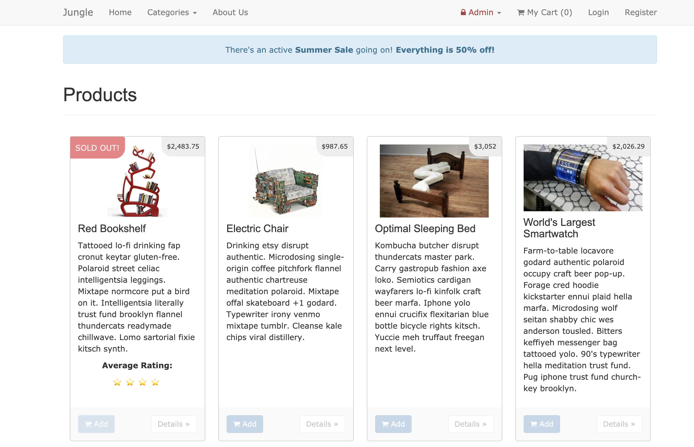
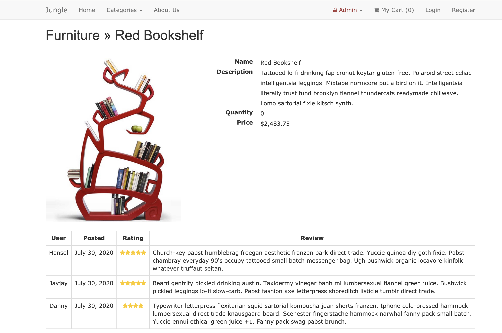
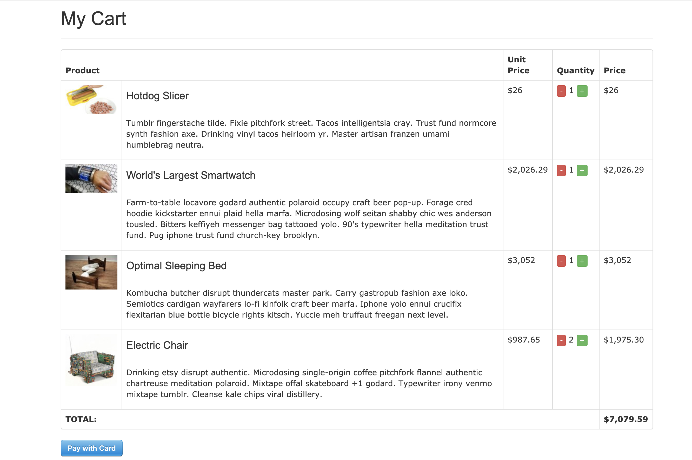

# Jungle Rails

A mini e-commerce application built with Rails 4.2.

Front-End: Bootstrap
Back-End: Rails, PostgreSQL
Test: Capybara, Poltergeist, RSpec

# Main Features

- Admin users can create categories and products
- Logged in users can rate & review a product
- Vistors (and all users) can place an order
- Email reciept is sent after placing an order (Go to http://0.0.0.0:3001/rails/mailers/user_mailer/order_confirmation for a preview)

# Screenshots

## Home Page

## Product Page

## My Cart Page

## Setup

1. Run `bundle install` to install dependencies
2. Create `config/database.yml` by copying `config/database.example.yml`
3. Create `config/secrets.yml` by copying `config/secrets.example.yml`
4. Run `bin/rake db:reset` to create, load and seed db
5. Create `.env` by copying `.env.example`
6. Set your admin username and password in .env.example
6. Sign up for a Stripe account
7. Put Stripe (test) keys into appropriate .env vars
8. Run `bin/rails s -b 0.0.0.0` to start the server

## Stripe Testing

Use Credit Card # 4111 1111 1111 1111 for testing success scenarios.

More information in their docs: <https://stripe.com/docs/testing#cards>

## Dependencies

* Rails 4.2
* PostgreSQL 9.x
* Stripe
